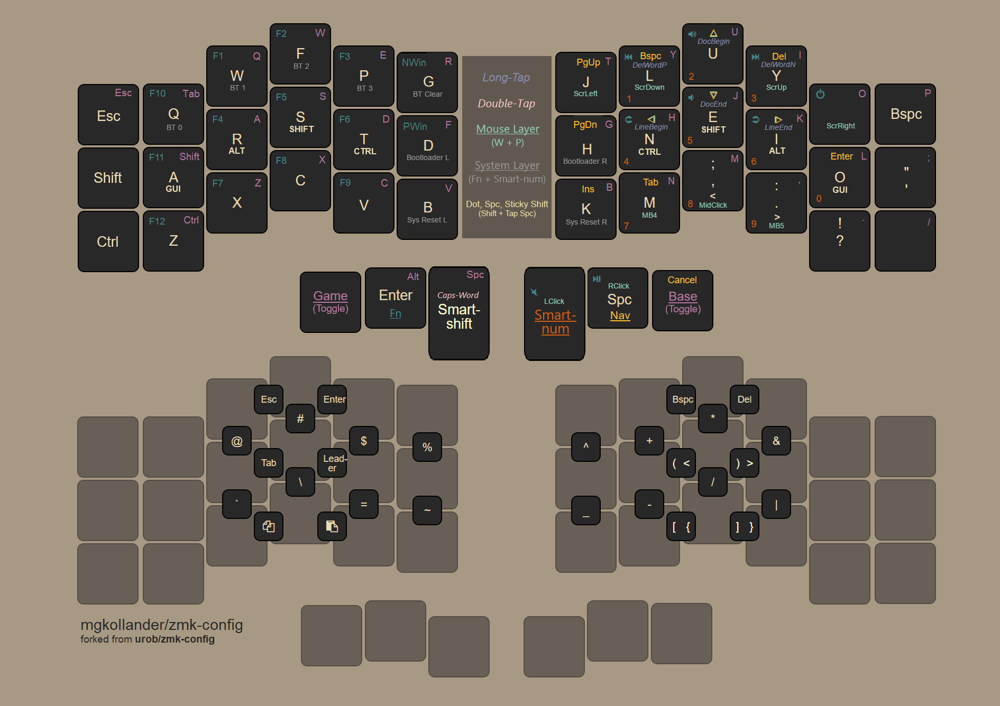

# zmk-config

This is my personal [ZMK firmware](https://github.com/zmkfirmware/zmk/) configuration. 
It is ported from my QMK configuration, which in turn is heavily inspired by Manna Harbour's
[Miryoku layout](https://github.com/manna-harbour/miryoku).

## Key features

- simple macro-implementation of combos and keymap to fit different physical keyboards
- home-row mods on base layer, sticky mods on `Nav` and `Num` layers
- most symbols can be accessed from the base layer via combos
- sticky shift on right thumb, double-tap activates caps-word
- backspace morphs into delete when shifted
- unicode layer with Greek letters for mathematical typesetting (not yet ported to ZMK)

## Keymap layout

## Thoughts on combo layout

The combo layout is guided by two goals: (1) put all combos in easy-to-access locations,
and (2) make them easy to remember. Specifically:

- the top vertical-combo row is almost equivalent to the symbols on standard number rows,
  making them easy to remember
- the bottom vertical-combo row is set up symmetrically to facilitate memorization
  (subscript `_` aligns with superscript `^`; `-` aligns with `+`; division `/` aligns 
  with multiplication `*`; logical-or aligns with logical-and; back-slash aligns 
  horizontally with forward-slash)
- parenthesis, brackets, braces and punctuation are on the right-hand side for easy
  usage when typing numbers
- a numlock shortcut (on `W+P`) is on the left-hand side for one-handed number-mode
- shortcuts for cut (on `X+D`), copy and paste are on the left-hand side for one-handed
  usage when using the mouse

