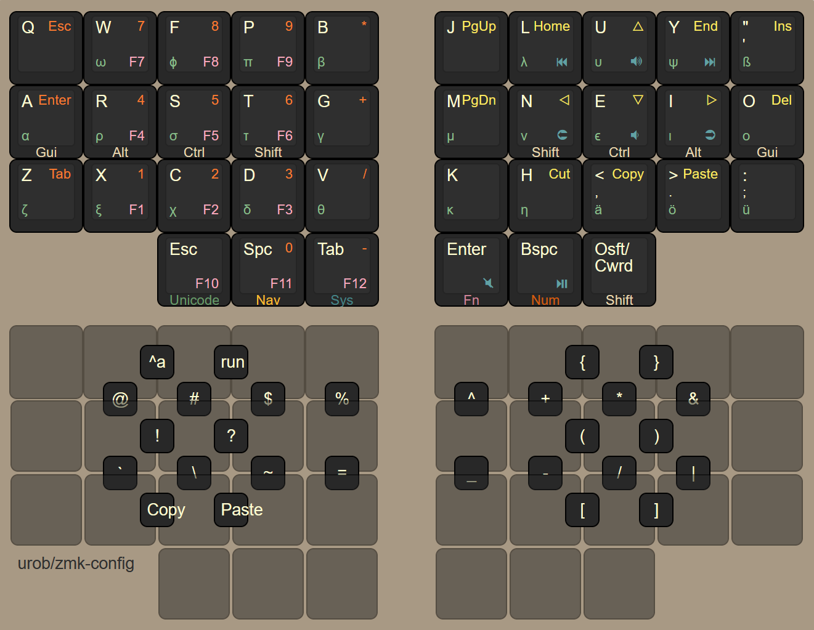

# urob's zmk-config

This is my personal [ZMK firmware](https://github.com/zmkfirmware/zmk/) configuration.
It consists of a 34-keys base layout that is re-used for various boards, including my
Corneish Zen and my Planck.

This branch is updated for the latest ZMK using Zephyr 3.2. A legacy version
compatible with Zephyr 3.0 is available
[here](https://github.com/urob/zmk-config/tree/main-zephyr-3.0).

## Highlights

- clean keymap + unicode setup using helper macros from
  [zmk-nodefree-config](https://github.com/urob/zmk-nodefree-config)
- the base keymap and combo setup are independent of the physical location of
  keys and are re-used for multiple keyboards. The configuration is fit onto
  larger boards by padding it via a modular structure of "extra keys"
- ["timer-less" homerow mods](#timeless-homerow-mods) 
- combos replacing the symbol layer
- smart numbers and smart mouse layers that automatically toggle off when done
- sticky shift on right thumb, double-tap (or shift + tap)[^1] activates caps-word
- arrow-cluster doubles as <kbd>home</kbd>, <kbd>end</kbd>, <kbd>begin/end of
  document</kbd> on long-press
- more intuitive shift-actions: <kbd>, ;</kbd>, <kbd>. :</kbd> and <kbd>? !</kbd>
- <kbd>shift</kbd> + <kbd>space</kbd> morphs into <kbd>dot</kbd> →
  <kbd>space</kbd> → <kbd>sticky-shift</kbd>
- "Greek" layer for mathematical typesetting (activated as sticky-layer via a combo)
- modified Github Actions workflow that recognizes git-submodules
- automated
  [build-scripts](https://github.com/urob/zmk-config/tree/main/scripts#readme)
  for local and Docker-based building (independently of VS Code)



## Timeless homerow mods

[Homerow mods](https://precondition.github.io/home-row-mods) (aka "HRMs") can
be a game changer -- at least in theory. In practice, they require some finicky
timing: In its most naive implementation, in order to produce a "mod", they
must be held *longer* than `tapping-term-ms`. In order to produce a "tap", they
must be held *less* than `tapping-term-ms`. This requires very consistent
typing speeds that, alas, I do not possess. Hence my quest for a "timer-less"
HRM setup.[^2]

After months of tweaking, I eventually ended up with a HRM setup that is
essentially timer-less, resulting in virtually no misfires. Yet it provides a
fluent typing experience with mostly no delays.

Let's suppose for a moment we set `tapping-term-ms` to something ridiculously
large, say 5 seconds. This makes the configuration timer-less of sorts. But it
has two problems: (1) To activate a mod we will have to hold the HRM keys for
what feels like eternity. (2) During regular typing, there are delays between
the press of a key and the time it appears on the screen.[^3] Enter two of
ZMK's best configuration options:
* To address the first problem, I use ZMK's `balanced` flavor, which produces a
  "hold" if another key is both pressed and released within the tapping-term.
  Because that is exactly what I normally do with HRMs, there is virtually
  never a need to wait past my long tapping term (see below for two
  exceptions).
* To address the typing delay, I use ZMK's `require-prior-idle-ms` property, which
  immediately resolves a HRM as "tap" when it is pressed shortly *after*
  another key has been tapped. This all but completely eliminates the delay.

This is great but there are still a few rough edges:

* When rolling keys, I sometimes unintentionally end up with "nested" key
  sequences: `key 1` down, `key 2` down and up, `key 1` up. Because of the
  `balanced` flavor, this would falsely register `key 1` as a mod. As a remedy,
  I use ZMK's `positional hold-tap` feature to force HRMs to always resolve as
  "tap" when the *next* key is on the same side of the keyboard. Problem
  solved.
* ... or at least almost. By default, positional-hold-tap
  performs the positional check when the next key is *pressed*. This is not
  ideal, because it prevents combining multiple modifiers on the same hand. To
  fix this, I use the `hold-trigger-on-release` setting, which delays the
  positional-hold-tap decision until the next key's *release*. With the setting,
  multiple mods can be combined when held, while I still get the benefit from
  positional-hold-tap when keys are tapped.
* So far, nothing of the configuration depends on the duration of
  `tapping-term-ms`. In practice, there are two reasons why I don't set it to
  infinity:
    1. Sometimes, in rare circumstances, I want to combine a mod with a
    alpha-key *on the same hand* (e.g., when using the mouse with the other
    hand). My positional hold-tap configuration prevents this *within* the
    tapping term. By setting the tapping term to something large but not crazy
    large (I use 280ms), I can still use same-hand `mod` + `alpha` shortcuts by
    holding the mod for just a little while before tapping the alpha-key.
    2. Sometimes, I want to press a modifier without another key (e.g., on
    Windows, tapping `Win` opens the search menu). Because the `balanced`
    flavour only kicks in when another key is pressed, this also requires
    waiting past `tapping-term-ms`.
* Finally, it is worth noting that this setup works best in combination with a
  dedicated shift for capitalization during normal typing (I like sticky-shift
  on a home-thumb). This is because shifting alphas is the one scenario where
  pressing a mod may conflict with `require-prior-idle-ms`, which may result in
  false negatives when typing fast.

Here's my configuration (I use a bunch of [helper
macros](https://github.com/urob/zmk-nodefree-config) to simplify the syntax, but they
are not necessary):

```C++
/* use helper macros to define left and right hand keys */
#include "../zmk-nodefree-config/keypos_def/keypos_36keys.h"                // keyposition helpers
#define KEYS_L LT0 LT1 LT2 LT3 LT4 LM0 LM1 LM2 LM3 LM4 LB0 LB1 LB2 LB3 LB4  // left-hand keys
#define KEYS_R RT0 RT1 RT2 RT3 RT4 RM0 RM1 RM2 RM3 RM4 RB0 RB1 RB2 RB3 RB4  // right-hand keys
#define THUMBS LH2 LH1 LH0 RH0 RH1 RH2                                      // thumb keys

/* left-hand HRMs */
ZMK_BEHAVIOR(hml, hold_tap,
    flavor = "balanced";
    tapping-term-ms = <280>;
    quick-tap-ms = <175>;                // repeat on tap-into-hold
    require-prior-idle-ms = <150>;
    bindings = <&kp>, <&kp>;
    hold-trigger-key-positions = <KEYS_R THUMBS>;
    hold-trigger-on-release;             // delay positional check until key-release
)

/* right-hand HRMs */
ZMK_BEHAVIOR(hmr, hold_tap,
    flavor = "balanced";
    tapping-term-ms = <280>;
    quick-tap-ms = <175>;                // repeat on tap-into-hold
    require-prior-idle-ms = <150>;
    bindings = <&kp>, <&kp>;
    hold-trigger-key-positions = <KEYS_L THUMBS>;
    hold-trigger-on-release;             // delay positional check until key-release
)
```

### Required firmware

After a recent round of patches, the above configuration now works with
upstream ZMK. 

Other parts of my configuration still require a few PRs that aren't yet in
upstream ZMK. My personal [ZMK fork](https://github.com/urob/zmk) includes all
PRs needed to compile my configuration. If you prefer to maintain your own fork
with a custom selection of PRs, you might find this [ZMK-centric introduction
to Git](https://gist.github.com/urob/68a1e206b2356a01b876ed02d3f542c7) helpful.

### Troubleshooting

Hopefully, the above configuration "just works". If it doesn't, here's a
few smaller (and larger) things to try.

* **Noticeable delay when tapping HRMs:** Increase `require-prior-idle-ms`. As a rule of thumb,
  you want to set it to at least `10500/x` where `x` is your (relaxed) WPM for English prose.[^4]
* **False negatives (same-hand):** Reduce `tapping-term-ms` (or disable
  `hold-trigger-key-positions`)
* **False negatives (cross-hand):** Reduce `require-prior-idle-ms` (or set flavor
  to `hold-preferred` -- to continue using `hold-trigger-on-release`, you must
  also [patch
  ZMK](https://github.com/celejewski/zmk/commit/d7a8482712d87963e59b74238667346221199293)
  or use [an already patched branch](https://github.com/urob/zmk))
* **False positives (same-hand):** Increase `tapping-term-ms`
* **False positives (cross-hand):** Increase `require-prior-idle-ms` (or set
  flavor to `tap-preferred`, which requires holding HRMs past tapping term to
  activate)

## Using combos instead of a symbol layer

I am a big fan of combos for all sort of things. In terms of comfort, I much prefer them
over accessing layers that involve lateral thumb movements to be activated, especially
when switching between different layers in rapid succession.

One common concern about overloading the layout with combos is that they lead to
misfires. Fortunately, the above-mentioned PR #1387, also adds a `require-prior-idle` option 
for combos, which in my experience all but completely eliminates the problem -- even
when rolling keys on the home row!

My combo layout aims to place the most used symbols in easy-to-access
locations while also making them easy to remember. Specifically:

- the top vertical-combo row matches the symbols on a standard numbers row
  (except `+` and `&` being swapped)
- the bottom vertical-combo row is symmetric to the top row (subscript `_`
  aligns with superscript `^`; minus `-` aligns with `+`; division `/` aligns
  with multiplication `*`; logical-or `|` aligns with logical-and `&`)
- parenthesis, braces, brackets are set up symmetrically as horizontal combos with `<`,
  `>`, `{` and `}` being accessed from the Navigation layer
- left-hand side combos for `tap`, `esc`, `enter`, `cut` (on <kbd>X</kbd> + <kbd>D</kbd>),
  `copy` and `paste` that go well with right-handed mouse usage
- <kbd>L</kbd> + <kbd>Y</kbd> switches to the Greek layer for a single key
  press, <kbd>L</kbd> + <kbd>U</kbd> + <kbd>Y</kbd> activates one-shot shift in
  addition
- <kbd>W</kbd> + <kbd>P</kbd> activates the smart mouse layer

## Smart layers and other gimmicks

##### Numword

Inspired by Jonas Hietala's
[Numword](https://www.jonashietala.se/blog/2021/06/03/the-t-34-keyboard-layout/#where-are-the-digits)
for QMK, I implemented my own version of [Smart-layers for
ZMK](https://github.com/zmkfirmware/zmk/pull/1451). It is triggered via a
single tap on "Smart-Num". Numword continues to be activated as long as I
type numbers, and deactivates automatically on any other keypress (holding it activates 
a non-sticky num layer).

After using Numword for about 6 months now, I have been overall very happy with it. When
typing single digits, it effectively is a sticky-layer but with the added advantage that 
I can also use it to type multiple digits. 

The main downside is that if a sequence of numbers is *immediately* followed by any of the
letters on which my numpad is located (WFPRSTXCD), then the automatic deactivation won't
work. But this is rare -- most number sequences are terminated by `space`, `return` or some form
of punctuation/delimination. To deal with the rare cases where they aren't, there is a 
`CANCEL` key on the navigation-layer that deactivates Numword, Capsword and Smart-mouse. 
(It also toggles off when pressing `Numword` again, but I find it cognitively easier to
have a dedicated "off-switch" than keeping track of which modes are currently active.)


##### Smart-Mouse

Similarly to Numword, I have a smart-mouse layer (activated by comboing
<kbd>W</kbd> + <kbd>P</kbd>), which replaces the navigation cluster with
scroll and mouse-movements, and replaces the right thumbs with mouse buttons.
Pressing any other key automatically deactivates the layer.

##### Capsword

My right thumb triggers three variations of shift: Tapping yields
sticky-shift (used to capitalize alphas), holding activates a regular shift, and
double-tapping (or equivalently shift + tap) activates ZMK's Caps-word behavior.

One minor technical detail: While it would be possible to implement the double-tap functionality
as a tap-dance, this would add a delay when using single taps. To avoid the delays, I 
instead implemented the double-tap functionality as a mod-morph.

##### Multi-purpose Navigation cluster

To economize on keys, I am using hold-taps on my navigation cluster, which yield `home`, `end`,
`begin/end of document`, and `delete word forward/backward` on long-presses.

##### Swapper

I am using [Nick Conway](https://github.com/nickconway)'s fantastic
[tri-state](https://github.com/zmkfirmware/zmk/pull/1366) behavior for a
one-handed Alt-Tab switcher (`PWin` and `NWin`).

##### Repeat

I recently switched to 25g-chocs on one of my keyboards. I already was very happy with
my combos prior to that (even with heavy-ish MX-switches). But with the light chocs, I
find that I can now even use them for regular typing. While I haven't yet tried
placing alphas on combos, I am currently experimenting with a `repeat` combo on
my home row that I use to reduce SFUs when typing double-letter words.

## Issues and workarounds

Since I switched from QMK to ZMK I have been very impressed with how easy it is
to set up relatively complex layouts in ZMK. For the most parts I don't miss
any functionality (to the contrary, I found that ZMK supports many features
natively that would require complex user-space implementations in QMK). Below
are a few remaining issues:

- ZMK does not yet support "tap-only" combos
  ([#544](https://github.com/zmkfirmware/zmk/issues/544)), requiring a brief
  pause when wanting to chord HRMs that overlap with combo positions. As a
  workaround, I implemented all homerow combos as homerow-mod-combos. This is
  good enough for day-to-day, but does not address all edge cases (eg
  dynamically adding/removing mods doesn't work well). Having a native solution
  akin to QMK's "COMBO_MUST_TAP" property would be fantastic.
- Another item on my wishlist are adaptive keys
  ([#1624](https://github.com/zmkfirmware/zmk/issues/1624)). This would open
  the door for things like <kbd>space</kbd><kbd>space</kbd> becoming
  <kbd>.</kbd><kbd>space</kbd><kbd>sticky-shift</kbd>. (Using tap-dance isn't
  really an option here due to the delay it adds)
- A minor thing is that ZMK doesn't yet support any keys on the
  desktop-user-page; e.g., OS sleep
  ([#1077](https://github.com/zmkfirmware/zmk/issues/1077),
  [#1535](https://github.com/zmkfirmware/zmk/issues/1535))
- Very minor: `&bootloader` doesn't work with stm32 boards like the Planck
  ([#1086](https://github.com/zmkfirmware/zmk/issues/1086))

[^1]: Really what's happening is that `Shift` + my right home-thumb morph into
  caps-word. This gives me two separate ways of activating it: (1) Holding the
  homerow-mod shift on my left index-finger and then pressing my right home-thumb, which
  is my new preferred way. Or, (2) double-tapping the right home-thumb, which also works
  because the first tap yields sticky-shift, activating the mod-morph upon the second
  tap. But even when only activating via double-tapping, this implementation is advantageous
  compared to using tap-dance as it does not create any delay when single-tapping the key.

[^2]: I call it "timer-less", because the large tapping-term makes the behavior
  insensitive to the precise timings. One may say that there is still the
  `require-prior-idle` timeout. However, with both a large tapping-term and
  positional-hold-taps, the behavior is *not* actually sensitive to the
  `require-prior-idle` timing: All it does is reduce the delay in typing; i.e., variations
  in typing speed won't affect *what* is being typed but merely *how fast* it appears on
  the screen.

[^3]: The delay is determined by how quickly a key is released and is not
  directly related to the tapping-term. But regardless of its length, most
  people still find it noticable and disruptive.

[^4]: E.g, if your WPM is 70 or larger, then the default of 150ms (=10500/70)
    should work well. The rule of thumb is based on an average character length
    of 4.7 for English words. Taking into account 1 extra tap for `space`, this
    yields a minimum `require-prior-idle-ms` of (60 * 1000) / (5.7 * x) ≈ 10500 / x
    milliseconds. The approximation errs on the safe side,
    as in practice home row taps tend to be faster than average.
